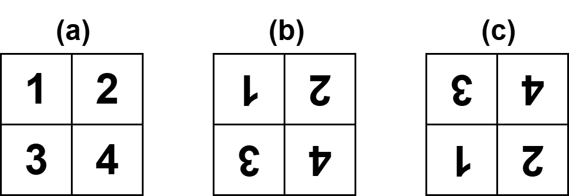

> 해당 게시물은 주인장이 [종만북](https://book.algospot.com/)을 공부하며 정리한 내용입니다.

## 7.1 도입

분할 정복(Divider & Conquer)은 가장 유명한 알고리즘 디자인 패러다임. 분할 정복이 일반적인 재귀 호출과 다른 점은 문제를 한 조각과 나머지 전체로 나누는 대신 **거의 같은 크기의 부분 문제로 나누는 것.** 분할 정복을 사용하는 알고리즘들은 아래의 3가지의 구성 요소를 가짐.
- 문제를 더 작은 문제로 분할하는 과정(divide)
- 각 문제에 대해 구한 답을 원래 문제에 대한 답으로 병합하는 과정(merge)
- 더 이상 답을 분할하지 않고 곧장 풀 수 있는 매우 작은 문제(base case)

분할 정복은 다음과 같은 필요 조건을 가지며 장점은 대부분의 경우 같은 작업을 더 빠르게 처리해 준다는 장점을 가지고 있다. 아래의 예제를 살펴보며 알아보자.

### 예제: 수열의 빠른 합

6.2절에서는 1부터 n까지의 합을 재귀 호출을 이용해 계산하는 \(recursiveSum()\) 함수를 아래와 같이 사용했다.

```c++
// code 6.1
int recursiveSum(int n) {
    if(n == 1) return 1;
    return n + recursiveSum(n-1);
}
```

#### 구현

여기서는 분할 정복을 이용해 똑같은 일을 하는 \(fastSum()\) 함수를 만들어보자. 


\begin{align}
    fastsum() = 1 + 2 + \cdots + n \newline
    = (1 + 2 + \cdots + {n/2}) + ((n/2+1) + \cdots + n)
\end{align}

위와 같이 반으로 뚝 잘라 n/2개의 조각들로 만들어진 부분 문제 두개를 만든다. 첫 번째 부분 문제는 \(fastSum(n/2)\) 로 나타낼 수 있지만, 두 번째 부분 문제는 그렇지 않다. 재귀적으로 풀기 위해서는 각 부분 문제를 **1부터 n까지의 합** 꼴로 표현할 수 있어야 하는데,두번째 부분 문제는 **a부터 b까지의 합** 형태를 가지고 있기 때문이다. 따라서 아래와 \(fastSum(x)\) 를 포함하는 형태로 바꿔야 한다.


\begin{align}
    (n/2+1) + \cdots + n \newline = (n/2 + 1) + (n/2 + 2) + \cdots + (n/2 + n/2) \newline
    = n/2 * n/2 + (1+2+3+\cdots+n/2) \newline
    = n/2 * n/2 + fastSum(n/2)
\end{align}

공통 된 항을 빼내면 \(fastSum(n/2)\) 로 정리할 수 있다. 따라서 아래와 같이 점화식을 작성할 수 있다.


\begin{align}
    fastSum(n) = 2 * fastSum(n/2) + n^2/4 \space\space [n \space is \space even]
\end{align}

```c++
// code 7.1
int fastSum(int n) {
    if(n == 1) return 1;
    if(n % 2 == 1) return fastSum(n-1) + n;
    return 2 * fastSum(n/2) + (n/2) * (n/2);
}
```

#### 시간 복잡도 분석

\(fastSum()\) 과 \(recursiveSum()\) 의 시간 복잡도는 순전히 함수가 호출되는 횟수에 비례한다. \(recursiveSum()\) 의 경우 n번이 함추 호출이 필요하다는 것을 쉽게 알 수 있고, \(fastSum()\) 은 호출될 때 마다 최소 두 번에 한 번 꼴로 n이 절반으로 줄어드니 \(fastSum()\) 의 호출 횟수가 훨씬 적을 것을 쉽게 예상할 수 있다.


\begin{align}
    fastSum(1011_2) = fastSum(1010_2) + 11 \newline
    fastSum(1010_2) = fastSum(101_2) * 2 + 25 \newline
    fastSum(101_2) = fastSum(100_2) + 5 \newline
    fastSum(100_2) = fastSum(10_2) * 2 + 4 \newline
    fastSum(10_2) = fastSum(1_2) * 2 + 1 \newline
    fastSum(1_2) = 1
\end{align}

위는 \(fastSum(11)\) 을 실행할 때 재귀 호출이 어떻게 변화하는지를 보여준다. \(n\)의 이진수 표현의 마지막 자리가 1이면 0으로 바뀌고, 마지막 자리가 0이면 끝자리가 없어진다는 것을 알 수 있다. 따라서 총 호출 횟수는 **\(n\)의 이진수 표현의 자릿수 + 첫자리를 제외하고 나타나는 1의 개수**가 되어 \(O(lgn)\) 이 상한인 것을 확인할 수 있다.

### 예제: 행렬의 거듭제곱

#### 구현

\(n*n\) 크기의 행렬 \(A\)가 주어질 때, \(A\)를 연속해서 \(m번\) 곱한 거듭제곱 \(A^m\) 구하는 시간 복잡도는 \(O(n^3m)\)이 됩니다. \(n=100, \space m=1,000,000\) 일 때 필요한 연산의 수는 1조가 되기 때문에 분할 정복을 사용해야 함.


\begin{align}
    A^m = A^{m/2} * A^{m/2}
\end{align}


```c++
// code 7.2
class SquareMatrix; // 정방행렬을 표현하는 클래스
SquareMatrix identity(int n); // n * n크기의 항등 행렬을 반환하는 함수
SquareMatrix pow(const SquareMatrix &A, int m) { // A^m을 반환하는 함수
    if(m == 0) return identity(A.size());
    if(m % 2 > 0) return pow(A, m-1) * A;
    SquareMatrix half = pow(A, m/2);
    return half * half;
}
```

#### 나누어 떨어지지 않을 때의 분할과 시간 복잡도

\(m\)이 홀수일 때, \(A^m = A * A^{m-1}\)로 나누지 않고, 더 절반에 가깝네 나누는 게 좋지 않을까라는 생각을 할 수 있다. 그러나 이 문제에서 더 절반에 가깝게 나누는 분할은 오히려 더 느리게 만든다. 아래의 \(pow(A,31)\)의 의존관계를 통해 쉽게 확인할 수 있다.


flowchart LR
    subgraph A ["홀수를 절반으로 나누는"]
        A0[" "]
        A1["pow(A,31)"] --> A2["pow(A,16)"]
        A1 --> A3["pow(A,15)"]
        A2 --> A4["pow(A,8)"]
        A3 --> A5["pow(A,7)"]
        A4 --> A6["pow(A,4)"]
        A5 --> A7["pow(A,3)"]
        A6 --> A8["pow(A,2)"]
        A8 --> A9["pow(A,1)"]
        A7 --> A9
        A99[" "]
    end
    
    style A0 fill:transparent,stroke:transparent
    style A99 fill:transparent,stroke:transparent  
    style A9 fill:#000,color:#fff



flowchart LR

    subgraph B ["홀수에서 1을 빼서 짝수로"]
        B0[" "]
        B1["pow(A,31)"] --> B2["pow(A,30)"]
        B2 --> B3["pow(A,15)"]
        B3 --> B4["pow(A,14)"]
        B4 --> B5["pow(A,7)"]
        B5 --> B6["pow(A,6)"]
        B6 --> B7["pow(A,3)"]
        B7 --> B8["pow(A,2)"]
        B8 --> B9["pow(A,1)"]
        B99[" "]
    end

    style B0 fill:transparent,stroke:transparent
    style B99 fill:transparent,stroke:transparent
    style B9 fill:#000,color:#fff


호출되는 횟수를 비교해 보면 홀수를 절반으로 나누는 첫 번째 의존 관계는 \(O(m-1\)), 홀수에서 1을 빼서 짝수로 만든 뒤 절반으로 나누는 두 번째 의존 관계는 \(O(lgm\))번 호출된다는 것을 살펴볼 수 있다. 같은 문제라도 어떻게 분할하느냐에 따라 시간 복잡도 차이가 커진다는 것을 보여주는 좋은 예시다.

### 예제: 병합 정렬과 퀵 정렬

#### 개요

병합 정렬(Merge sort)와 퀵 정렬(Quick sork) 두 알고리즘은 모두 분할 정복 패러다임을 기반으로 해서 만들어진 것이다. 직접적인 구현이나 증명은 이미 충분히 되어 있으니 생략하고 동작 원리와 시간복잡도를 알아보자. <br>
병합정렬은 가운데에서 쪼개 비슷한 크기의 수열로 나누고 재귀 호출을 이용해 각각 정렬한다. 이후 정렬 된 배열을 하나로 합침으로써 정렬된 수열을 얻는다. <br>
퀵 정렬은 가운데에서 쪼개는 대신, 병합 과정이 필요 없도록 한쪽의 배열에 포함된 수가 다른 쪽 배열의 수보다 항상 작도록 분할한다. 이를 위해 파티션(partition)이라고 부르는 단계를 도입하는데, 이는 배열에 있는 수 중 임의의 기준 수(pivot)를 지정한 뒤 기준보다 적가나 같은 숫자를 왼족, 더 큰 숫자를 오른쪽으로 보내는 과정이다. 


flowchart LR

    subgraph A ["병합 정렬"]
        A1["38 27 43 9 3 82 10"]
        A1 --> A2["38 27 43 9"]
        A1 --> A3["3 82 10"]
        
        A2 --> A4["38 27"]
        A2 --> A5["43 9"]
        A3 --> A6["3 82"]
        A3 --> A7["10"]
        
        A4 --> A8["38"]
        A4 --> A9["27"]
        A5 --> A10["43"]
        A5 --> A11["9"]
        A6 --> A12["3"]
        A6 --> A13["82"]
        
        A8 --> A14["27 38"]
        A9 --> A14
        A10 --> A15["9 43"]
        A11 --> A15
        A12 --> A16["3 82"]
        A13 --> A16
        A7 --> A17["10"]
        
        A14 --> A18["9 27 38 43"]
        A15 --> A18
        A16 --> A19["3 10 82"]
        A17 --> A19
        
        A18 --> A20["3 9 10 27 38 43 82"]
        A19 --> A20
    end



위 그림으로 병합 정렬의 동작 과정을 살펴보자. 각 수열의 크기가 1이 될 때까지 절반씩 쪼갠 뒤, 정렬 된 부분 배열들을 합쳐 나간다. 주어진 배열을 가운데서 그냥 나누는 것이다. 이는 \(O(1)\)만에 수행할 수 있으며, 병합하는 과정은 \(O(n)\)만에 수행할 수 있다.


flowchart LR

    subgraph B ["퀵 정렬"]
        B1["38 27 43 9 3 82 10"]
        B1 --> B2["27 9 3 10"]
        B1 --> B3["(38)"]
        B1 --> B4["43 82"]
        
        B2 --> B5["9 3"]
        B2 --> B6["(27)"]
        B2 --> B7["10"]
        B4 --> B8["(43)"]
        B4 --> B9["82"]
        
        B5 --> B10["3"]
        B5 --> B11["(9)"]
        B5 --> B12[" "]
        
        B10 --> B13["3 9 10 27"]
        B11 --> B13
        B7 --> B13
        B6 --> B13
        
        B8 --> B14["43 82"]
        B9 --> B14
        
        B13 --> B15["3 9 10 27 38 43 82"]
        B3 --> B15
        B14 --> B15
    end

    style B3 fill:#e1f5fe,stroke:#01579b
    style B6 fill:#e1f5fe,stroke:#01579b
    style B8 fill:#e1f5fe,stroke:#01579b
    style B11 fill:#e1f5fe,stroke:#01579b
    style B12 fill:transparent,stroke:transparent



위 그림으로 퀵 정렬의 동작 과정을 살펴보자. 각 부분 수열의 맨 처음에 있는 수를 기준(pivot)으로 삼고, 이보다 작은 수는 왼쪽으로, 큰 수는 오른쪽으로 가도록 한다. 이로 인해 분할 과정은 \(O(n)\)의 시간이 걸리지만, 각 부분 배열이 이미 정렬한 상태가 되어 별도의 병합 작업이 필요 없다는 장점이 있다. <br>
따라서 두 정렬은 \(O(n)\)의 시간이 걸리는 과정을 재귀 호출 전에 하느냐, 후에 하느냐가 다를 뿐 본질적으로 비슷한 형태의 알고리즘이다.

#### 시간 복잡도 분석

병합 정렬의 시간 복잡도는 **병합 과정**에 지배된다. 한 단계 내에서 모든 병합에 필요한 총 시간은 \(O(n)\)으로 항상 일정하고, 문제의 크기는 항상 거의 절반으로 나누어지기 때문에 필요한 단계의 수는 \(O(lgn)\)이 됩니다. 따라서 병합 정렬의 시간 복잡도는 \(O(nlgn)\)라는 것을 알 수 있다. <br>
퀵 정렬의 시간 복잡도는 문제를 나누는 **파티션 과정**에 지배된다. 파티션 과정에는 주어진 수열의 길이에 비례하는 시간이 걸릴 것이므로 사실 병합 정렬에서의 병합 과정과 크게 다를 것이 없다. 하지만 퀵 정렬의 시간 복잡도를 분석하기 까다로운 것은 분할 된 두 수열이 비슷한 크기로 나눠진다는 보장을 할 수 없기 때문이다. **기준으로 택한 원소가 최소거나 최대 원소인 경우** 부분 문제의 크기가 하나씩만 줄어드는 최악의 상황이 발생할 수도 있기 때문이다. 이런 최악의 경우 \(O(n^2)\)의 시간이 소요되지만 평균적으로 수열이 절반에 가깝게 나눠질 때 \(O(nlgn)\)이 된다고 알려져 있다. 그래서 대부분의 퀵 정렬 구현은 가능한 절반에 가까운 분할을 하기 위해 좋은 기준을 뽑는 다양한 방법을 사용한다.

### 예제: 카라츠바의 빠른 곱셈 알고리즘

러시아의 카라츠바가 만든 빠른 곱셈 알고리즘으로 32비트 이상의 큰 숫자들을 다룰 때 사용한다. 



$$
\begin{array}{r}
1234 \\
\times \quad 5678 \\
\hline
9872 \\
8638 \\
7404 \\
6170 \\
\hline
7006652
\end{array}
$$

<br>

$$
\begin{array}{r}
1234 \\
\times \quad 5678 \\
\hline
8 \quad 16 \quad 24 \quad 32 \\
7 \quad 14 \quad 21 \quad 28 \\
6 \quad 12 \quad 18 \quad 24 \\
5 \quad 10 \quad 15 \quad 20 \\
\hline
5 \quad 16 \quad 34 \quad 60 \quad 61 \quad 52 \quad 32
\end{array}
$$

당연히 정수형 배열을 사용해서 저장하며 곱할 수의 각 자릿 수를 맨 아래 자리부터 저장하고 있다. 예를 들어 \(1234\)는 \([4,3,2,1]\)와 같이 저장한다. 이렇게 순서를 뒤집으면 입출력할 때는 불편하지만 \(A[i]\)에 주어진 자릿수의 크기를 \(10^i\)로 쉽게 구할 수 있다. 따라서 \(A[i]\)와 \(B[i]\)를 곱한 결과를 \(C[i+j]\)에 저장하는 등 직관적인 코드를 작성할 수 있다.

```c++
// code 7.3 O(N^2) multiply
void normalize(vector<int> &num) {
    num.push_back(0);
    for(int i=0; i+1<num.size(); i++) {
        if(num[i] < 0) { // 음수인 경우 자리내림
            int borrow = (abs(num[i]) + 9) / 10;
            num[i+1] -= borrow;
            num[i] += borrow * 10;
        }
        else { // 양수인 경우 자리올림
            num[i+1] += num[i]/10;
            num[i] %= 10;
        }
    }
    while(num.size() > 1 && num.back() == 0)
        num.pop_back();
}

vector<int> multiply(const vector<int> &a, const vector<int> &b) {
    vector<int> c(a.size() + b.size() + 1, 0);
    for(int i=0; i<a.size(); i++)
        for(int j=0; j<b.size(); j++)
            c[i+j] += a[i] * b[j];
    normalize(c);
    return c;
}
```

위 7.3 코드는 \(O(n^2)\)이 자명하다. 카라츠바의 빠른 곱셈 알고리즘은 두 수를 절반으로 쪼개는 방식으로 이를 개선했다. \(a\)와 \(b\)가 각각 256자리 수라면 \(a_1\)과 \(b_1\)은 128자리, \(a_0\)와 \(a_0\)는 그 다음 128자리를 저장하는 방식이다. 아래와 같이 정리할 수 있다.


\begin{align}
a = a_1 * 10^{128} + a_0 \newline
b = b_1 * 10^{128} + b_0 \newline
a * b = (a_1 * 10^{128} + a_0) * (b_1 * 10^{128} + b_0) \newline
a * b = a_1 * b_1 * 10^{256} + (a_1 * b_0 + a_0 * b_1) * 10^{129} + a_0 * b_0
\end{align}

위와 같이 전개를 할 수 있지만, 4번의 곱셈이 필요하며 증명을 하면 동일하게 \(O(n^2)\)의 시간이 걸려 분할 정복으로 애써 구현한 의미가 없어진다. 카라츠바는 이를 4번의 곱셈이 아니라 3번의 곱셈으로 계산할 수 있다는 것을 증명했다. 아래 (18) 수식에서 아래와 같이 \(z\)를 치환한다.


\begin{align}
z_2 = a_1 * b_1 \newline
z_0 = a_0 * b_0 \newline
z_1 = (a_0 + a_1) * (b_0 + b_1) - z_0 -z _2 \newline
a * b = z_2 * 10^{256} + z_1 * 10^{128} + z_0
\end{align}

```c++
// code 7.4 karatsuba multiply
void addTo(vector<int>& a, const vector<int>& b, int k); // a+=b * (10^k)
void subFrom(vector<int>& a, const vector<int>& b); // a-=b
vector<int> karatsuba(const vector<int>& a, const vector<int>& b) {
   int an = a.size(), bn = b.size();
   
   if(an < bn) return karatsuba(b, a);
   if(an == 0 || bn == 0) return vector<int>();
   if(an <= 50) return multiply(a, b);
   
   int half = an / 2;
   
   vector<int> a0(a.begin(), a.begin() + half);
   vector<int> a1(a.begin() + half, a.end());
   vector<int> b0(b.begin(), b.begin() + min<int>(b.size(), half));
   vector<int> b1(b.begin() + min<int>(b.size(), half), b.end());
   
   vector<int> z2 = karatsuba(a1, b1);
   vector<int> z0 = karatsuba(a0, b0);
   
   addTo(a0, a1, 0); addTo(b0, b1, 0);
   
   vector<int> z1 = karatsuba(a0, b0);
   subFrom(z1, z0);
   subFrom(z1, z2);
   
   vector<int> ret;
   addTo(ret, z0, 0);
   addTo(ret, z1, half);
   addTo(ret, z2, half + half);
   return ret;
}
```

#### 시간 복잡도 분석
코드 7.4 구현에서 카라츠바 알고리즘은 병합 단계는 \(addTo()\)와 \(subFrom()\)의 수행시간이 지배되고, 기저 사례 처리 시간은 \(multiply()\)의 수행 시간에 지배된다. 자릿수 n이 2의 거듭제곱 \(2^k\)라고 했을 때 재귀 호출의 깊이는 k가 된다. 한번 쪼갤 때마다 처리 할 곱셈의 수가 3배씩 늘어가디 매누에 마지막 단계에는 \(3^k\)개의 부분 문제가 있다. 따라서 곱셈의 수는 \(O(3^k)\)가 된다. \(n = 2^k\)라고 가정했으니 \(k=lgn\)이고, 따라서 총 시간 복잡도는 **\(O(3^k)) = (3^{lgn} = O(n^{lg3})\)** 이 된다.

## 7.2 문제: 쿼드 트리 뒤집기

[문제 링크](https://algospot.com/judge/problem/read/QUADTREE) <br>
하나의 노드가 0/4개의 자식을 가질 수 있는 쿼드 트리이다. 이진 트리를 하나의 문자열(순회)로 압축 시 2개의 문자열이 필요하지만, 쿼드 트리는 제약사항으로 인해 하나의 문자열로 재표현 할 수 있다. 책에서는 2차원 배열을 활용해는 첫 번째 버전의 코드를 보여주지만 문제에 명시되어 있듯 원본 그림의 크기가 \(2^{20} * 2^{20})이기 때문에 어림 잡아도 메모리 초과로 고려 대상이 아닌 풀이법이니 다루지 않고, 하나의 문자열로 해결하는 코드를 다루겠다.


위 그림은 문제의 핵심 병합 과정을 가장 잘 보여준다. 원본 그림을 4등분해서 각 부분을 그림(a)와 같을 때, 재귀 호출을 통해 4부분을 각각 상하로 뒤집으면 그림(b)가 된다. 여기에서 위 2조각과 아래 2조각을 서로 바꾸면 그림 (c) 를 얻을 수 있는데 이것이 우리가 원하던 전체가 뒤집힌 그림이다. 이를 코드로 구현하면 아래와 같다.

```c++
// code 7.6 quadtree reverse divide & conquer
string reverse(string::iterator &it) {
    char head = *it;
    ++it;
    if(head == 'b' || head == 'w')
        return string(1, head);
    string upperLeft = reverse(it);
    string upperRight = reverse(it);
    string lowerLeft = reverse(it);
    string lowerRight = reverse(it);
    return string("x") + lowerLeft + lowerRight + upperLeft + upperRight;
}
```

시간 복잡도는 함수가 호출되는 횟수는 문자열 길이의 비례하므로 \(O(n)\)이며, 각 문자열을 합치는데 \(O(n)\)의 시간이 소요된다고 해도 \(n<=1,000\)이기 때문에 \(O(n^2)\) 제한 시간 이내에 시행 가능하다.

## 7.4 문제: 울타리 잘라내기
[문제 링크](https://algospot.com/judge/problem/read/FENCE) <br> 백준의 [히스토그램](https://www.acmicpc.net/problem/1725)과 동일한 문제다. 너비가 1인 막대 그래프의 높이가 입력으로 주어질 때, 막대 그래프 내부에서 가장 큰 직사각형의 넓이를 구하는 문제이다. 비스듬히 배치할 수는 없다. \(n<=20,000\)이므로 \(O(n^2)\)이상의 시간이 소요되는 브루트포스로는 풀 수 없다. 분할 정복으로 설계해보자. n개의 판자가 있을 때 절반으로 나눠 두 개의 부분 문제를 만들 때, 우리가 찾는 최대 직사각형은 다음 3가지 중 하나에 속할 것이다.

- 가장 큰 직사각형은 왼쪽 부분 문제에 있다.
- 가장 큰 직사각형은 오른쪽 부분 문제에 있다.
- 가장 큰 직사각형은 양쪽 부분 문제에 걸쳐 있다.

첫 번째와 두 번째 경우는 고민할 필요가 없다. 양쪽 부분 문제에 걸쳐 있는 경우 어떻게 가장 큰 직사각형은 찾을 수 있을까? 가장 큰 힌트는 **반드시 부분 문제 경계에 있는 두 판자를 포함한다는 데 있다.** 가장 큰 직사각형을 찾으려면 **항상 사각형의 높이를 최대화하는 방향으로 선택해서 확장해야 한다.** 이는 귀류법으로 증명이 가능하니 한번씩 시도해보길 바란다.

```c++
// code 7.8 histogram divide & conquer
vector<int> h;
int solve(int left, int right) {
    if(left == right) return h[left];
    int mid = (left + right) / 2;
    int ret = max(solve(left, mid), solve(mid + 1, right));
    int low = mid, hi = mid + 1;
    int height = min(h[lo], h[hi]);
    ret = max(ret, height * 2);
    while(left < lo || hi < right) {
        if(hi < right && (lo == left || h[lo - 1] < h[hi + 1]))
            ++hi, height = min(height, h[hi]);
        else
            --lo, height = min(height, h[lo]);
        ret = max(ret, height * (hi - lo + 1));
    }
    return ret;
}
```

문제를 항상 절반으로 나누어서 재귀를 호출하고, \(O(n)\)의 작업 시간이 걸리므로 \(O(nlgn)\)을 갖는다. n <= 20,000이기 때문에 제한 시간 이내에 시행 가능하다.

## 7.6 문제: 팬미팅

N명의 남성 아이돌 멤버와 M명의 팬이 있을 때, 여성 팬들과 만나면 포옹을 하는데 모든 멤버가 포옹을 하는 일이 몇 번이나 있는지 출력하는 문제이다. 브루트포스로 풀 경우 \(O(NM)\)이 예상되는데 \(N<=200,000\)이다. 그래서 \(O(N^{lg3})\)인 카라츠바 곰셈 알고리즘을 도입한다. [카라츠바](#예제-카라츠바의-빠른-곱셈-알고리즘)에 대한 자세한 구현은 위에서 이전에 살펴봤으니 생략했다.

- 여자 = 0, 남자 1으로 변환
- 1 * 1 = 1 (남자 멤버와 남재 팬) <- **이 때만 악수!**
- 멤버를 다항식 \(A(x)\), 팬을 다항식 \(B(x)\)로 치환

```c++
int hugs(const string &members, const string &fans) {
    int N = member.size(), M = fans.size();
    vector<int> A(N), B(M);
    for(int i = 0; i < N; i++) A[i] = (members[i] == 'M');
    for(int i = 0; i < M; i++) B[M-i-1] = (fans[i] == 'M');
    vector<int> C = karatsuba(A, B);
    int allHugs = 0;
    for(int i = N - 1; i < M; i++)
        if(C[i] == 0)
            ++allHugs;
    return allHugs;
}
```

